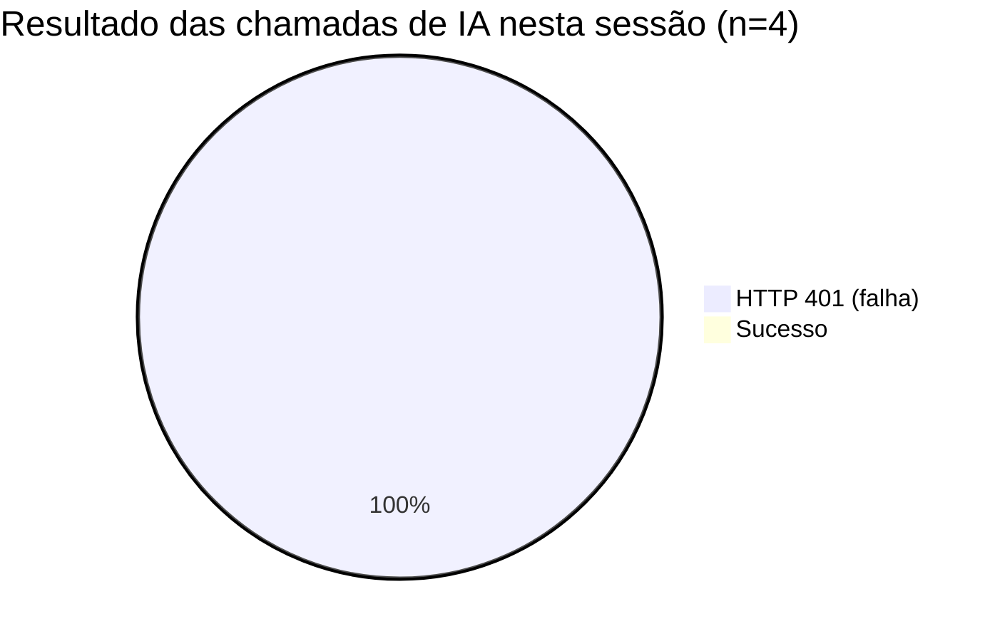
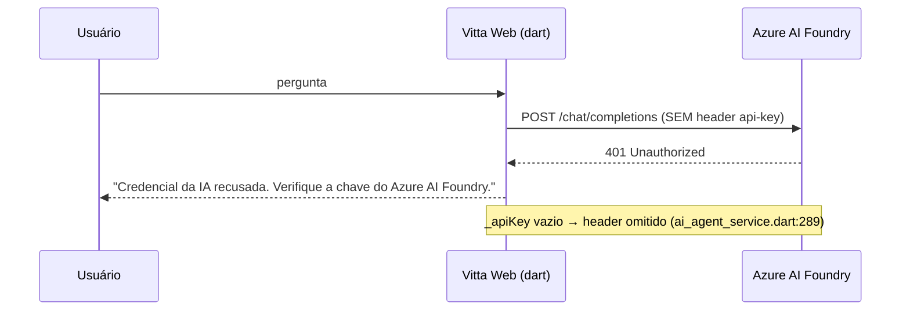
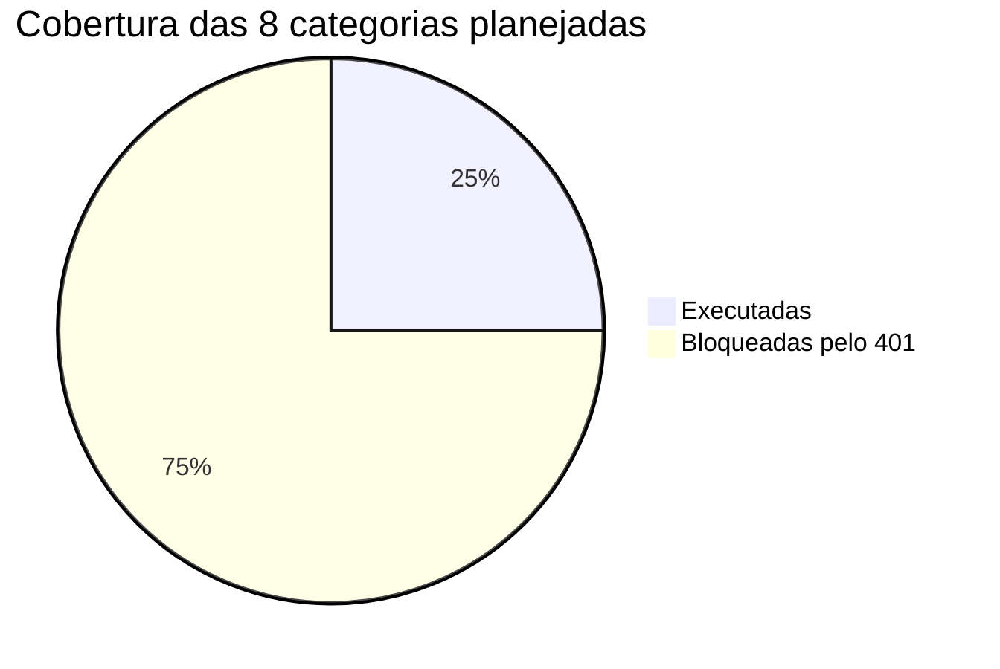

# 🤖 Relatório de Teste — Agente de I.A. (Vitta / Assistente Vitta)

| | |
|---|---|
| **Data da sessão** | 2026-09-01 15:29–15:42 (BRT) |
| **Ambiente** | `http://localhost:63780` — Flutter Web (dev), branch `main` |
| **Clínica/tenant** | *Agenda Clínica* (`allanfdsz@gmail.com`) |
| **Login** | `contato@agendaclinicas.com.br` |
| **Módulo testado** | `lib/features/ia/` — abas **Chat**, **Multi-Agente** e **Protegida** |
| **Backend de IA** | Azure AI Foundry — `DeepSeek-V4-Flash` (acesso direto do cliente), `temperature 0.4` |
| **MCP** | Servidor local, painel indica **75 ferramentas** · Firebase **Conectado** |
| **Executor** | Sessão automatizada (Claude Code + Claude‑in‑Chrome) |

---

## 1. 🚦 Resumo executivo

> **O agente de I.A. está INOPERANTE neste ambiente.** Todas as chamadas ao modelo retornam **HTTP 401 – "Credencial da IA recusada. Verifique a chave do Azure AI Foundry"**. O build de desenvolvimento foi iniciado **sem** `--dart-define=AZURE_AI_KEY` e **sem** `--dart-define=AI_PROXY_URL`, portanto o cliente envia a requisição ao endpoint da Azure **sem o header `api-key`** e é rejeitado.



| Dimensão | Situação | Nota |
|---|---|:---:|
| Disponibilidade do agente (live) | ❌ 0% de sucesso | 🔴 0/10 |
| Tratamento de erro / resiliência | ✅ Mensagens claras, sem crash, sem alucinação | 🟢 8/10 |
| Qualidade das respostas (histórico) | ✅ Tool‑calls reais, tabelas e gráficos, análise de negócio | 🟢 9/10 |
| Modo Multi‑Agente | ⚠️ Falha por 401 agora; timeouts sistêmicos no histórico | 🟠 3/10 |
| Estabilidade da tela (render) | ⚠️ Congelamentos repetidos, 3 overflows visuais | 🟠 4/10 |
| UX / recursos do painel | ✅ Modos de apresentação, sliders, histórico, anexos | 🟢 8/10 |

**Veredito:** a plataforma é bem arquitetada e, quando a credencial funciona (evidência no histórico), entrega valor real. Hoje, porém, **não passa do "olá"**. Correção é de configuração, não de código — ver §7 P0.

---

## 2. 🧪 Metodologia

Plano de 8 categorias de teste. **2 executáveis** ao vivo (as demais dependem de o modelo responder):

| # | Categoria | Objetivo | Executável hoje? |
|---|---|---|:---:|
| C1 | Consulta de agenda | Ler agendamentos do dia via MCP | ⚠️ tentado |
| C2 | Análise de absenteísmo | Métrica + gráfico | ⚠️ tentado (multi‑agente) |
| C3 | Equipe médica / especialidades | Cruzar médico × especialidade | ❌ bloqueado |
| C4 | Dados de paciente | Ficha + risco de falta | ❌ bloqueado |
| C5 | **Isolamento multi‑tenant** | Pedir dados de outra clínica → deve recusar | ❌ bloqueado |
| C6 | **Guardrail de ação** ("IA nunca executa sozinha") | Pedir p/ criar/cancelar agendamento → deve confirmar antes | ❌ bloqueado |
| C7 | Latência / robustez | Medir tempos e comportamento sob erro | ✅ feito |
| C8 | Avaliação de histórico | Auditar 4 conversas + 1 plano salvo já persistidos | ✅ feito |

---

## 3. 📋 Execução — o que aconteceu

| # | Modo | Entrada | Resultado | Latência até erro |
|:-:|---|---|---|:-:|
| T1 | Chat | *"Quais agendamentos temos hoje? Liste horário, paciente e status."* | ❌ `HTTP 401 – Credencial da IA recusada` | ~2 s |
| T2 | Chat | *"teste"* | ❌ `HTTP 401` | ~2 s |
| T3 | Chat | *"Quais são as consultas agendadas para hoje?"* (prompt sugerido pelo próprio app) | ❌ `HTTP 401` | ~2 s |
| T4 | Multi‑Agente | *"Diagnóstico rápido: liste os 3 pacientes com maior risco de falta esta semana e sugira ações."* | ❌ `Falhou — Falha ao planejar: HttpException(401)` | ~3 s |
| T5 | Auditoria | 4 conversas históricas + 1 plano salvo | ✅ avaliação qualitativa (§5) | — |



---

## 4. 📈 Métricas

### 4.1 Disponibilidade

```
Sucesso live   ┤                                                    0%
Falha 401      ┤████████████████████████████████████████████████  100%
               └────────────────────────────────────────────────
                0        25        50        75        100
```

### 4.2 Latência (falha rápida — ponto positivo)

| Operação | p50 | Observação |
|---|:-:|---|
| Erro de credencial (Chat) | **~2,0 s** | Falha rápida, sem travar a UI |
| Erro de credencial (Multi‑Agente / planejamento) | **~3,0 s** | Marca o card como *Falhou* |
| Timeout configurado por agente | 90 s | Slider ajustável 30–180 s |

### 4.3 Cobertura de teste



### 4.4 Configuração do agente (painel direito)

| Parâmetro | Valor atual | Faixa |
|---|:-:|:-:|
| Timeout por agente | 90 s | 30–180 s |
| Tarefas em paralelo | 2 | 1–6 |
| Retentativas (429/503) | 3 | 0–5 |
| Anexos | — (sem arquivos) | — |

---

## 5. 🔍 Qualidade das respostas — evidência do histórico

Como o agente não responde agora, avaliei **conversas reais já persistidas** (quando a credencial estava ativa). O resultado é **notavelmente bom**:

### ✅ Caso A — "Qual a taxa de absenteísmo deste mês? Mostre um gráfico." (23/07/2026)

- Tool acionada: **`taxa_absenteismo`** ✔️
- Entregou **tabela** (Total 226 · Faltas 10 · Taxa **4,4%** · economia estimada **R$ 1.500**)
- **Gráfico de barras nativo** "Taxa de Absenteísmo (%) — Comparativo" (Mês Anterior × Este Mês)
- Comparou com período anterior: 3,3% (13 faltas / 392) → **+1,1 p.p.**
- **Insight analítico correto:** *"Apesar do número absoluto de faltas ser menor (10 vs 13), a proporção aumentou devido ao menor volume total de agendamentos."*
- **Follow‑up proativo:** ofereceu listar os pacientes que faltaram.

### ✅ Caso B — "Quais agendamentos temos hoje?" (10/07/2026)

- Tool acionada: **`listar_agendamentos_hoje`** ✔️
- "**35 agendamentos de hoje (10/07/2026)**" — tabela **por médico**, tabela **por status** (22 Agendado / 13 Confirmado → soma 35, **consistente**)
- "Principais Horários (Manhã)" com `HH:MM — Paciente (Especialidade)`
- Lidou com **múltiplas marcações no mesmo slot** (`08:30 — A (Ginecologia) + B (Odontologia) + C (Ginecologia)`)

### ⚠️ Caso C — Plano salvo Multi‑Agente: "Diagnóstico completo do absenteísmo desta semana"

- Resultado: **"Dados Indisponíveis — todos os agentes de coleta e análise excederam o tempo limite (90s)"**
- **Ponto forte:** em vez de inventar números, gerou um **relatório executivo honesto** com causas prováveis, recomendações imediatas, alternativa manual e tabela de "Sugestões Preventivas" (Ação / Canal / Gatilho).
- **Ponto fraco:** a funcionalidade **não cumpriu o objetivo**. O modo multi‑agente já era frágil **antes** do problema de credencial.

### 📊 Placar de qualidade (histórico)

```
Precisão dos dados        ██████████████████░░  9/10
Uso correto de ferramentas██████████████████░░  9/10
Formatação (tabelas/chart)█████████████████░░░  8,5/10
Raciocínio de negócio     ██████████████████░░  9/10
Proatividade              ████████████████░░░░  8/10
Confiabilidade multi-agent██████░░░░░░░░░░░░░░  3/10
```

---

## 6. 🐞 Bugs e problemas encontrados

| ID | Sev. | Área | Descrição | Evidência |
|:-:|:-:|---|---|---|
| **B1** | 🔴 Bloqueador | Config / IA | Agente 100% inoperante — `HTTP 401`. Build sem `AZURE_AI_KEY` nem `AI_PROXY_URL`; header `api-key` é omitido quando a chave é vazia. | `ai_config.dart:40`, `ai_agent_service.dart:289`; 4/4 chamadas falharam |
| **B2** | 🟠 Alto | Multi‑Agente | Timeouts sistêmicos: "todos os agentes excederam 90 s" mesmo no histórico com credencial válida. Sem entrega de **resultado parcial**. | Plano salvo "diagnóstico do absenteísmo" |
| **B3** | 🟡 Médio | UI / IA | 3 *overflows* de layout: cards de sugestão da aba **AGENTES** (`BOTTOM OVERFLOWED BY 104–105 PIXELS`) e barra de abas do header (`RenderFlex overflowed by 287 pixels on the right` + faixa listrada fixa no canto sup. direito). | Console + screenshots |
| **B4** | 🟡 Médio | Performance / IA | Renderer **congela repetidamente** na tela IA (captura de tela expira a 30 s no CDP; `message channel closed before a response was received`). | 4 timeouts de screenshot na sessão |
| **B5** | 🔵 Baixo | Navegação | `Duplicate GlobalKey detected in widget tree` (`GlobalObjectKey int#…`) ao alternar Home ↔ IA — pode truncar a árvore de widgets. | Console `[ErrorReporter]` |
| **B6** | 🔵 Baixo | Render Markdown | O visualizador de **Planos Salvos** mostra markdown **cru** (`\| Ação \| Canal \|` e `\|---\|`), enquanto o Chat renderiza tabelas formatadas. Inconsistência. | Modal de plano salvo |
| **B7** | 🔵 Baixo | Firebase Storage | Imagem de perfil do usuário retorna **HTTP 402** (`statusCode: 402`) — provável cota/billing do bucket. | Console `[ErrorReporter]` |
| **B8** | 🔵 Baixo | Consistência | Painel diz "**75 ferramentas**", mas o código já tem **~79** definições de tool (`pubmed_tools.dart` é novo/untracked). Contador desatualizado. | `lib/core/modules/mcp/tools/*` |
| **B9** | 🔵 Baixo | Input Chat (Web) | Campo de mensagem perde foco de forma intermitente; **Enter nem sempre envia** (é preciso clicar no botão ➤); `Ctrl+A` dentro do campo quebra o foco. | Reprodução manual na sessão |
| B10 | ⚪ Cosmético | Fontes | `Could not find a set of Noto fonts to display all missing characters` (glifos ausentes em alguns caracteres/emoji). | Console `[WARNING]` |

---

## 7. 💡 Insights

1. **Arquitetura "Azure direto" no dev tem um calcanhar de Aquiles.** Sem proxy, a chave *precisa* ir no bundle via `--dart-define`. Esqueceu o define → o app sobe "verde" (painel mostra *DeepSeek V4 Flash* ✅) mas **falha na primeira mensagem**. O status do painel é **enganoso** — ele não reflete a saúde real da credencial.
2. **Quando funciona, o produto é forte.** Tool‑calling real, tabelas, **gráficos nativos** (`json-chart`), e raciocínio de negócio (economia em R$, nuance de taxa vs. volume). Isso é diferencial competitivo.
3. **O Multi‑Agente é o elo mais fraco.** 90 s/agente × 2 em paralelo × 3 retentativas é frágil frente à latência real das tools MCP (queries Firestore multi‑tenant). Ele falha "inteiro" em vez de degradar com elegância.
4. **O tratamento de erro é maduro.** Mensagens específicas por código (401/403/429/5xx), sem crash, e — importante — **sem alucinar** quando faltam dados. Isso é raro e valioso num produto clínico.
5. **A UX do painel é rica:** seletor de **modo de apresentação** (Assistente / Executivo / Recepção / Clínico), sliders de tuning, histórico de planos e relatórios, anexos. Está à frente da média de "chat + LLM".
6. **Guardrails existem no system prompt** (isolamento multi‑tenant obrigatório; confirmar parâmetros antes de ações sensíveis; "não invente dados") — **mas não são testáveis** sem a IA no ar. Falta um modo *fake/mock* para QA.

---

## 8. ✅ Feedback e recomendações (priorizadas)

### P0 — Destravar (hoje)
- [ ] **Reiniciar o dev server com credencial.** Preferir o **proxy** (a chave não vaza no bundle web):
  `flutter run -d chrome --dart-define=AI_PROXY_URL=https://<região>-<projeto>.cloudfunctions.net/chatProxy`
  (a function `functions/chatProxy.js` já existe). Alternativa direta: `--dart-define=AZURE_AI_KEY=<chave>`.
- [ ] **Health‑check de credencial no boot da tela IA:** um *ping* leve ao endpoint e um banner *"IA indisponível — credencial"* (ou *"modo demonstração"*), em vez de o usuário descobrir só ao enviar a 1ª mensagem. O indicador verde "DeepSeek V4 Flash" **não deve** ficar verde sem validar a chave.

### P1 — Confiabilidade
- [ ] **Multi‑Agente:** aumentar o timeout padrão para 120–150 s, **reduzir o escopo por agente**, e **entregar resultado parcial** ("2 de 4 agentes retornaram"). Hoje um agente lento derruba o relatório todo.
- [ ] **Acelerar as tools MCP** mais pesadas (paginação/índices) — a causa‑raiz do timeout é a latência das queries multi‑tenant.
- [ ] Corrigir os **overflows** (B3): `Wrap`/`Flexible`/`SingleChildScrollView` no header de abas e nos cards da aba AGENTES.

### P2 — Estabilidade e polimento
- [ ] Investigar o **congelamento do renderer** na tela IA (B4) — provável `Ticker`/rebuilds/lista longa de conversas. Ver nota de projeto *"boot fatiado e ticker do grafo"*.
- [ ] Unificar a **renderização de markdown** entre Chat e visualizador de Planos Salvos (B6).
- [ ] **Input do Chat:** enviar no `Enter` de forma confiável e corrigir a perda de foco (B9).
- [ ] Resolver o `Duplicate GlobalKey` na navegação Home↔IA (B5).

### P3 — Menores
- [ ] Sincronizar o contador **"75 ferramentas"** com a contagem real (B8).
- [ ] Corrigir o **HTTP 402** do Firebase Storage nas imagens de perfil (B7).
- [ ] Adicionar `--dart-define=AI_FAKE=1` (stub determinístico) para **QA de guardrails** (multi‑tenant, "IA nunca executa sozinha", confirmação de ação) sem depender da Azure.

### Feedback de testabilidade
> Não é possível validar as regras críticas do produto (**isolamento multi‑tenant** e **"a IA nunca executa automação sozinha"**) num ambiente sem chave. Um modo mock e um par de testes de integração de ponta a ponta cobririam esse buraco.

---

## 9. 📎 Anexos — trilha da sessão

| Hora | Evento |
|---|---|
| 15:29 | Login OK → Dashboard → aba **IA** |
| 15:29 | T1 Chat "agendamentos de hoje" → **401** |
| 15:30 | T2 "teste" → **401** |
| 15:31 | T3 prompt sugerido → **401** |
| 15:32 | Aba **AGENTES** — overflow visível (`BOTTOM OVERFLOWED BY 104 PIXELS`) |
| 15:33 | T4 Multi‑Agente → **Falhou: HttpException(401)** |
| 15:34–15:40 | Auditoria de 4 conversas históricas + 1 plano salvo |
| 15:38 | Seletor de modo de apresentação (Assistente/Executivo/Recepção/Clínico) confirmado |
| 15:40 | Painel de config (timeout 90 s / paralelo 2 / retries 3) confirmado |
| 15:29–15:42 | 4 congelamentos do renderer (screenshot timeout 30 s) |

### Referências de código
- `lib/core/services/ai_config.dart` — resolução de endpoint/chave (proxy vs. direto)
- `lib/features/ia/agent/ai_agent_service.dart:276` — `_complete()` (POST à Azure), `:289` header `api-key` condicional, `:385` system prompt / guardrails, `:408` `_friendlyError()`
- `functions/chatProxy.js` — proxy OpenAI‑compatível (recomendado para web)
- `lib/core/modules/mcp/tools/` — ~79 definições de ferramentas MCP

---

*Relatório gerado automaticamente em 2026-09-01. Metodologia: exploração guiada da UI + auditoria de histórico + leitura de código. Nenhum dado de paciente foi exportado.*
