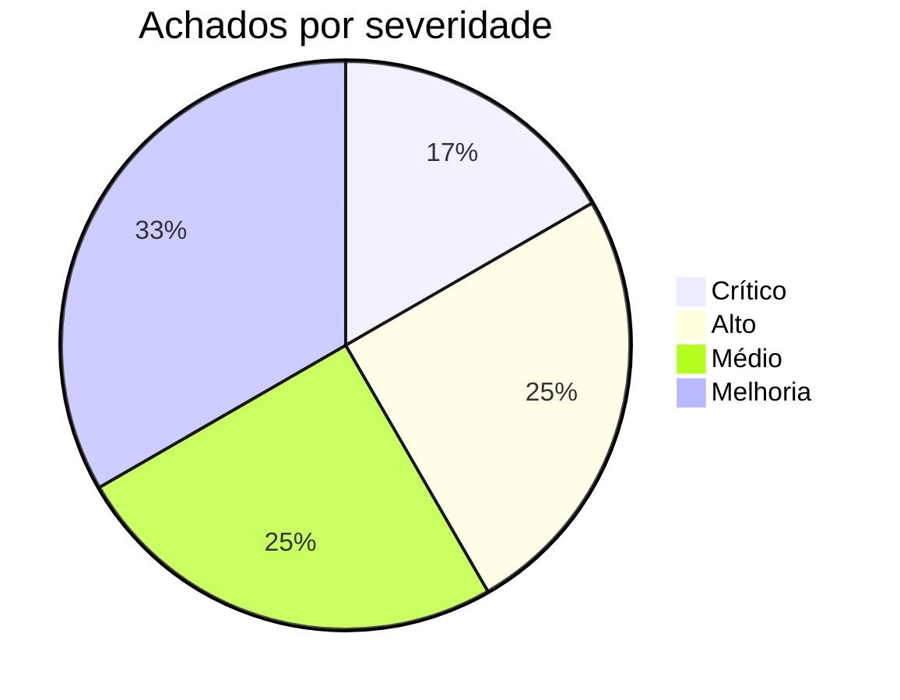

# 🖥️ Relatório de Teste — Totem de Autoatendimento · 10 agendamentos simultâneos

| | |
|---|---|
| **Data** | 2026-09-01 15:45–15:55 (BRT) |
| **Alvo** | `lib/features/totem/totem_screen.dart` (fluxo welcome → schedule → confirm → success) |
| **Ambiente** | `http://localhost:63780` — Flutter Web em **modo dev** (`flutter run`) |
| **Cenário** | Criar 10 agendamentos em rápida sucessão / abas paralelas e observar erros |
| **Status do teste** | ⚠️ **Parcial** — teste de carga pela UI **não pôde ser concluído** (ambiente caiu, ver §1). Análise de código completa. |

---

## 1. ⛔ Bloqueio do teste ao vivo

Depois de ~20 min de uso, o servidor `flutter run` **parou de renderizar qualquer rota**. `#/totem` e até `#/login` (que abriam normalmente no início da sessão) ficam em **tela branca por mais de 90 s**, em abas novas e após `F5`.

- Console para em `DDC is about to load 1443/1443 scripts with pool size = 1000` e não emite o primeiro frame.
- Nenhuma exceção Dart no console — o `main()` simplesmente não conclui o boot.
- O renderer também **congelou repetidamente** antes disso (capturas de tela expirando a 30 s no CDP).

> **Conclusão:** o **modo dev do Flutter Web (DDC, 1443 módulos não-empacotados) não aguenta uma sessão de QA/carga.** Isso, por si só, é um achado — ver **M4**.
>
> **Para concluir o teste ao vivo, reinicie o servidor**, de preferência em release:
> `flutter run -d chrome --release`  *(ou `flutter build web` + servir a pasta `build/web`)*

O restante deste relatório vem da **auditoria de código do fluxo do totem** — que já revela os problemas que os "10 agendamentos simultâneos" iriam expor.

---

## 2. 🎯 Resumo executivo



| # | Severidade | Achado (uma linha) |
|---|:--:|---|
| **F1** | 🔴 Crítico | ID do agendamento = `apt-${millisecondsSinceEpoch}` → **colisão** sob criação rápida/paralela |
| **F2** | 🔴 Crítico | Totem usa `add()` (só estado local) — **o agendamento nunca é gravado no Firestore** |
| **F3** | 🟠 Alto | Checagem de lotação (`slot.full`) **não é atômica** — 10 reservas concorrentes furam a capacidade |
| **F4** | 🟠 Alto | `clinicId` vem de `selectedClinicIdProvider` (placeholder `'c1'`), violando invariante do projeto |
| **F5** | 🟠 Alto | `patientId` de convidado = `totem-${millisecondsSinceEpoch}` → **colisão** entre cadastros simultâneos |
| **F6** | 🟡 Médio | Senha de atendimento é aleatória 100–999 sem checagem de unicidade (~4% de colisão em 10) |
| **F7** | 🟡 Médio | Limites anti-abuso conferidos contra estado local não-persistido — não enxergam reservas paralelas |
| **F8** | 🟡 Médio | Remarcação via totem (`move()`) também **não persiste**; e-mail/WhatsApp são disparados mesmo assim |
| M1–M4 | 🔵 Melhoria | Testabilidade, feedback de concorrência, `maxPerDay=1`, ambiente de QA |

---

## 3. 🔬 Achados detalhados

### 🔴 F1 — Colisão de ID do agendamento sob concorrência
**Arquivo:** `lib/features/totem/totem_screen.dart:673`
```dart
final appt = Appointment(
  id: 'apt-${DateTime.now().millisecondsSinceEpoch}',   // ← não é único
  ...
);
```
- **Problema:** dois agendamentos criados no mesmo milissegundo (abas paralelas, ou o mesmo device disparando rápido) recebem o **mesmo `id`**. Não há UUID, contador nem verificação.
- **Impacto (comprovado no código):**
  - `AppointmentsNotifier.add()` faz `state = [...state, appointment]` → a lista fica com 2+ itens de `id` idêntico.
  - `setStatus(id, …)`, `reschedule(id, …)`, `_persistStatus(id, …)` fazem `if (a.id == id)` → **mudança de status/horário atinge o agendamento errado (ou vários)**. (`app_providers.dart:646,654,711`)
  - `appointment_detail_screen.dart:27` → `appointments.where((a) => a.id == appointmentId)` retorna mais de um → tela de detalhe ambígua.
- **Repro:** abrir o totem em 2+ abas, concluir o agendamento nas duas "ao mesmo tempo".
- **Correção:** usar um id realmente único — `crypto.randomUUID()` / `Uuid().v4()`, ou o id do documento gerado pelo Firestore (`doc().id`).

---

### 🔴 F2 — O agendamento do totem não é persistido
**Arquivo:** `totem_screen.dart:689` + `lib/core/services/app_providers.dart:679`
```dart
// totem_screen.dart
ref.read(appointmentsProvider.notifier).add(appt);      // ← escolha errada

// app_providers.dart
void add(Appointment appointment) {
  state = [...state, appointment];                       // só memória; sem _persistCreate
}
void create(Appointment appointment) {                   // ESTE persiste
  state = [...state, appointment];
  unawaited(_persistCreate(appointment));                // → _service.create() → Firestore
}
```
- **Problema:** o totem chama `add()` (não persiste). O método `create()` — que grava em `tb_agendamentos` — **não é usado**. A remarcação (`move()`, `app_providers.dart:701`) também não persiste.
- **Impacto:** o paciente recebe **senha, e-mail e comprovante em PDF** (`_sendConfirmations`, `totem_screen.dart:690`), mas o agendamento **some ao recarregar** e **nunca chega à recepção/agenda/médico**. Agendamento-fantasma.
- **Repro:** agendar pelo totem → `F5` → o agendamento desapareceu da agenda.
- **Correção:** trocar `add(appt)` por `create(appt)` no totem (ou criar um `bookFromTotem()` que persista + trate o offline). Alinha com a nota de projeto *"Ações sem persistência"*.

---

### 🟠 F3 — Condição de corrida na checagem de lotação (overbooking §1)
**Arquivo:** `totem_screen.dart:338` (`_selectSlot`) e `:261-291` (`_buildSlots`)
- **Problema:** `if (slot.full) return;` usa o `booked` de um **snapshot** calculado quando a tela montou. Entre a seleção do slot e o `add()` (há ainda um `Future.delayed(500ms)` no meio, `:670`) **nada revalida a capacidade**. Não há trava nem transação.
- **Impacto:** 10 reservas concorrentes no mesmo `horário × médico` podem **todas** passar por `full == false` → capacidade (+ overbook configurado) é estourada silenciosamente. A recepção recebe mais pacientes do que o combinado.
- **Correção:** revalidar a ocupação imediatamente antes de confirmar (idealmente numa transação do Firestore que conte os ativos do slot e rejeite se `>= capacidade + overbook`).

---

### 🟠 F4 — `clinicId` do agendamento vem do provider errado
**Arquivo:** `totem_screen.dart:674`
```dart
clinicId: ref.read(selectedClinicIdProvider),
```
- **Problema:** viola a invariante nº 1 do projeto — *"a clínica ativa vem de `clinicaResolvidaProvider`, nunca de `selectedClinicIdProvider`"*. O totem é **público (sem login)**; sem clínica resolvida, `selectedClinicIdProvider` vale o placeholder de `MockData` (`'c1'`).
- **Impacto:** se F2 for corrigido, os agendamentos serão gravados numa **clínica inexistente** (`c1`). O `appointmentsProvider` (`app_providers.dart:727`) também usa `selectedClinicIdProvider` como chave do `watchForClinic`, então a contagem de ocupação pode ser de outro tenant.
- **Correção:** o totem precisa receber o `clinicaId` explicitamente (via config do totem / rota / QR do profissional) e usá-lo em tudo — nunca o placeholder.

---

### 🟠 F5 — Colisão de `patientId` em cadastros de convidado simultâneos
**Arquivo:** `totem_screen.dart:539`
```dart
await _createAppointment(
  patientId: 'totem-${DateTime.now().millisecondsSinceEpoch}',  // ← não é único
  ...
);
```
- **Impacto:** dois pacientes novos cadastrando no mesmo milissegundo compartilham `patientId` → agendamentos se fundem sob um "paciente", e os **limites anti-abuso** (`_bookingLimitMessage`, conta por `patientId`) passam a **conflar pessoas diferentes**.
- **Correção:** UUID, ou criar o doc do paciente no Firestore e usar o id retornado.

---

### 🟡 F6 — Senha de fila sem garantia de unicidade
**Arquivo:** `totem_screen.dart:322`
```dart
String _genSenha(String specialty) {
  final initial = specialty.isNotEmpty ? specialty[0].toUpperCase() : 'G';
  return '$initial${100 + _rng.nextInt(900)}';           // 3 dígitos aleatórios
}
```
- **Impacto:** 10 agendamentos na mesma especialidade → **~4% de chance** de duas senhas iguais (paradoxo do aniversário). Dois pacientes chamados com a mesma senha.
- **Correção:** contador sequencial por especialidade/dia (persistido/transacional), ou verificar contra as senhas ativas.

---

### 🟡 F7 — Limites anti-abuso contra estado local
**Arquivo:** `totem_screen.dart:564` (`_bookingLimitMessage`)
- `_activeAppointmentsOf(patientId, name)` lê do `appointmentsProvider` (memória, não-persistido). Duas abas fazendo agendamento para o **mesmo CPF** não se enxergam → ambas passam por `maxPerDay` / `maxActivePerPatient`.
- **Correção:** validar o limite no servidor (transação) no momento da gravação.

---

### 🟡 F8 — Remarcação via totem não persiste + efeitos colaterais disparam
**Arquivo:** `totem_screen.dart:485` (`_doReschedule`) → `app_providers.dart:701` (`move()` sem `_persist*`)
- O horário muda só na memória, mas `_sendConfirmations(..., isReschedule: true)` **envia e-mail/WhatsApp** com o novo horário. Paciente recebe confirmação de uma remarcação que o servidor desconhece.

---

## 4. 🧭 Dificuldades encontradas no teste (e como contornar)

| # | Dificuldade | Efeito no teste | Mitigação |
|---|---|---|---|
| D1 | **Ambiente dev caiu** (tela branca, DDC 1443 módulos) | Impossível rodar as 10 reservas pela UI | Rodar em `--release` ou `build/web` servido estaticamente |
| D2 | Flutter Web = **canvas, sem DOM** | Sem seletores estáveis; automação depende de screenshot | Expor `flutter driver` / `integration_test`, ou `SemanticsLabel` nos botões-chave |
| D3 | Renderer **congela** sob interação repetida | Screenshots expiram a 30 s | Ver nota de projeto *"boot fatiado e ticker do grafo"*; investigar rebuilds |
| D4 | Totem **expira sessão em 120 s** de inatividade (`sessionTimeout`) | Automação lenta perde o estado no meio | Aumentar timeout em ambiente de teste, ou agir rápido |
| D5 | `maxPerDay = 1` por padrão (`totem_config.dart:49`) | Não dá para fazer 10 agendamentos com **o mesmo** CPF | Usar 10 CPFs válidos distintos, ou zerar o limite na config do totem |
| D6 | Sem endpoint/hook para **injetar carga concorrente real** | "Simultâneo" na prática vira "sequencial rápido" numa aba | Script com N abas/headless, ou teste de integração disparando N `create()` em paralelo |

---

## 5. ✅ Melhorias recomendadas (priorizadas)

### P0 — Corrigir antes de usar o totem em produção
1. **F2:** totem deve **persistir** o agendamento (`create()` em vez de `add()`), com tratamento de falha/offline.
2. **F1 + F5:** IDs únicos de verdade (UUID v4 ou id do doc Firestore) para agendamento **e** paciente-convidado.
3. **F4:** `clinicaId` explícito no totem; nunca `selectedClinicIdProvider`.

### P1 — Concorrência
4. **F3 + F7:** validação de capacidade e de limite anti-abuso **no servidor, em transação**, no instante da gravação.
5. **F6:** senha de fila sequencial e única por dia/especialidade.
6. **F8:** persistir a remarcação; só disparar e-mail/WhatsApp **após** a gravação confirmar.

### P2 — Robustez e testabilidade (M1–M4)
7. **M1 (testabilidade):** `Semantics`/`Key` nos elementos do totem + suíte `integration_test` que cria N agendamentos em paralelo e verifica unicidade de id/senha e respeito à capacidade.
8. **M2 (feedback):** se a gravação falhar ou o slot lotar no último instante, a tela de sucesso **não** deve aparecer — mostrar erro claro e não emitir senha/comprovante.
9. **M3 (config):** avisar no painel quando `maxPerDay`/capacidade tornam o fluxo impossível para o dia escolhido.
10. **M4 (ambiente):** documentar que QA/carga do totem roda em `--release`; o modo dev não sustenta a sessão.

---

## 6. 📋 Plano de reteste (quando o ambiente voltar)

1. `flutter run -d chrome --release` (ou servir `build/web`).
2. Config do totem: `maxPerDay = 0`, capacidade do médico ≥ 12 no slot alvo, `sessionTimeout` alto.
3. Abrir 10 abas em `#/totem` → em cada uma: **Agendar → especialidade → mesmo slot → cadastro rápido (CPF distinto) → confirmar**, disparando os "Confirmar" o mais próximo possível.
4. Coletar: senhas geradas, ids (via `appointmentsProvider`/console), nº de agendamentos que aparecem na **agenda da recepção** após `F5`, e se a capacidade do slot foi respeitada.
5. Esperado hoje (pela análise): ids/patientIds colidindo, senhas possivelmente repetidas, **0 agendamentos persistidos**, capacidade possivelmente estourada.

---

## 7. 📎 Referências de código

- `lib/features/totem/totem_screen.dart`
  - `:322` `_genSenha` · `:338` `_selectSlot` (checagem `full`) · `:539` `patientId` convidado
  - `:639` `_createAppointment` · `:673` id do agendamento · `:674` `clinicId` · `:689` `add()` · `:690` `_sendConfirmations`
  - `:485` `_doReschedule` · `:560` `_bookingLimitMessage`
- `lib/core/services/app_providers.dart`
  - `:679` `add()` (não persiste) · `:686` `create()` (persiste) · `:701` `move()` (não persiste) · `:727` `appointmentsProvider`
- `lib/features/totem/models/totem_config.dart:46-52` — defaults (`maxPerDay=1`, `sessionTimeout=120`)
- `lib/navigation/app_router.dart:102-109` — totem é rota **pública**

---

*Relatório gerado em 2026-09-01. O teste de carga pela interface não foi concluído porque o servidor de desenvolvimento parou de responder; os achados acima vêm da auditoria do código do fluxo do totem e são suficientes para orientar a correção. Reexecutar o §6 após reiniciar o ambiente.*
